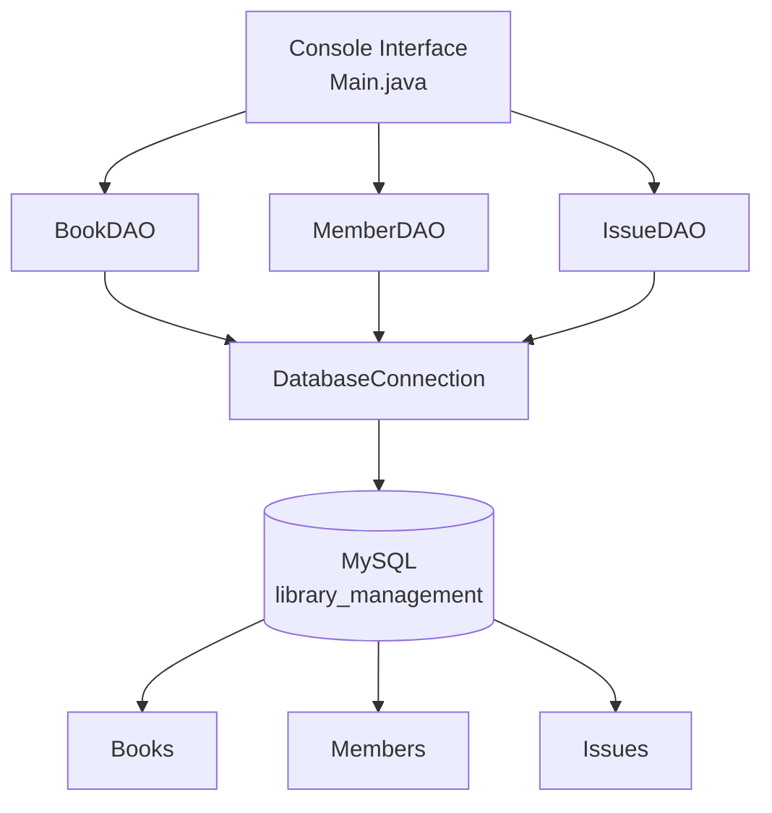

# 🚀 Library Management System — Java Mini Project

[](https://www.java.com)
[](https://docs.oracle.com/javase/tutorial/jdbc/)
[](https://www.mysql.com)
[](https://maven.apache.org)
[](https://github.com)

> A console-based library management application built with **Java, OOP, JDBC, Maven, and MySQL**. Designed as a practical mini project to implement book management, member management, issue/return workflows, database operations, and fine calculation.

---

## ✨ Core Features

- 📚 **Book Management**
  - Add and remove books
  - Search books
  - View complete book catalogue
  - Track total and available copies

- 👤 **Member Management**
  - Register library members
  - View member records
  - Store contact information

- 📤 **Book Issue & Return**
  - Issue available books to members
  - Automatically calculate due dates
  - Update book availability
  - Process book returns

- 💰 **Fine Management**
  - Calculate overdue fines
  - Track issue and return dates

- 🗄️ **Database Integration**
  - MySQL relational database
  - JDBC connectivity
  - DAO-based database operations

---

## 🏗️ Architecture Overview



---

## 🛠️ Technology Stack

| Layer | Technology | Purpose |
|---|---|---|
| **Language** | Java 17+ | Application development |
| **Architecture** | OOP + DAO | Code organization |
| **Database** | MySQL | Persistent data storage |
| **Connectivity** | JDBC | Java–MySQL communication |
| **Build Tool** | Maven | Dependencies and compilation |
| **Version Control** | Git + GitHub | Source code management |

---

## 📁 Repository Structure

```text
LibraryManagementSystem/
├── database/
│   └── schema.sql
├── src/
│   └── main/
│       └── java/
│           └── library/
│               ├── Book.java
│               ├── BookDAO.java
│               ├── DatabaseConnection.java
│               ├── IssueDAO.java
│               ├── Main.java
│               ├── Member.java
│               └── MemberDAO.java
├── .gitignore
├── pom.xml
└── README.md
```

---

## 🚦 Quickstart

### 1. Clone the Repository

```bash
git clone https://github.com/pashvithareddy-debug/LibraryManagementSystem.git
cd LibraryManagementSystem
```

### 2. Create the Database

Open MySQL:

```bash
mysql -u root -p
```

Then run:

```sql
source database/schema.sql;
```

### 3. Configure Database Credentials

The application reads the MySQL password from the `DB_PASSWORD` environment variable.

Set your local MySQL password:

```bash
export DB_PASSWORD='YOUR_MYSQL_PASSWORD'
```

The MySQL username is configured in:

```text
src/main/java/library/DatabaseConnection.java
```

> 🔐 The database password is intentionally not stored in the source code or GitHub repository.

### 4. Compile

```bash
mvn clean compile
```

### 5. Run

```bash
mvn exec:java
```

---

## 🖥️ Application Menu

```text
╔══════════════════════════════════════╗
║       LIBRARY MANAGEMENT SYSTEM      ║
╚══════════════════════════════════════╝

1. Add Book
2. Remove Book
3. Search Books
4. View Books
5. Add Member
6. View Members
7. Issue Book
8. Return Book
9. View Issued Books
0. Exit
```

---

## 📊 Sample Output

### Book Catalogue

```text
ID    TITLE                     AUTHOR              CATEGORY        TOTAL   AVAILABLE
1     Clean Code                Robert C. Martin     Programming     3       3
2     The Alchemist             Paulo Coelho         Fiction         2       2
```

### Issuing a Book

```text
Book ID: 1
Member ID: 1

Issued successfully.
Due: 2026-10-05
```

After issuing a book, its available quantity is automatically updated.

---

## 🧠 Concepts Practiced

This project provided practical experience with:

### Java

- Object-Oriented Programming
- Classes and Objects
- Encapsulation
- Constructors
- Methods
- Exception Handling

### Database

- MySQL
- SQL CRUD operations
- Relational database design
- Primary and foreign keys

### JDBC

- Database connections
- Prepared statements
- Result sets
- SQL execution from Java

### Software Development

- DAO Pattern
- Maven project management
- Environment variables
- Git
- GitHub

---

## 🔐 Security

The project avoids storing the MySQL password directly in the source code.

Database credentials are supplied through an environment variable:

```bash
export DB_PASSWORD='YOUR_MYSQL_PASSWORD'
```

This prevents local database credentials from being committed to the GitHub repository.

---

## 🗺️ Future Improvements

- [ ] JavaFX graphical interface
- [ ] User authentication
- [ ] Admin and member roles
- [ ] Advanced book search and filtering
- [ ] Member borrowing history
- [ ] Library statistics dashboard
- [ ] Email notifications for overdue books
- [ ] REST API
- [ ] Docker support

---

## 🎯 Project Type

**Mini Project**

This project was developed to strengthen practical skills in:

`Java` • `OOP` • `JDBC` • `MySQL` • `SQL` • `Maven` • `Git` • `GitHub`

---

## 👩‍💻 Author

### Ashvitha Reddy

**Computer Science Engineering Student**

`Software Engineering` • `AI/ML` • `Data Science` • `Cloud` • `Cybersecurity` • `DSA`

---

<div align="center">

### ⭐ Built as a Java Mini Project

**Learning by building. One project at a time.**

</div>
